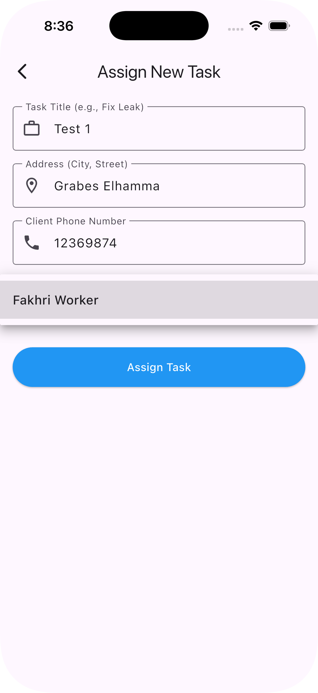
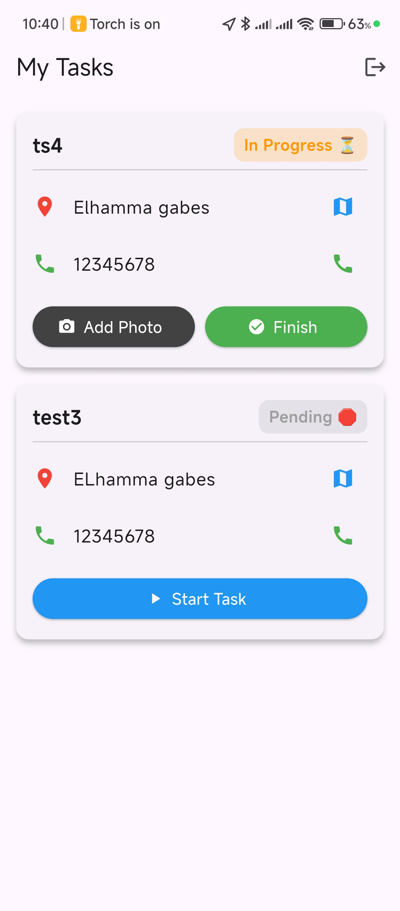
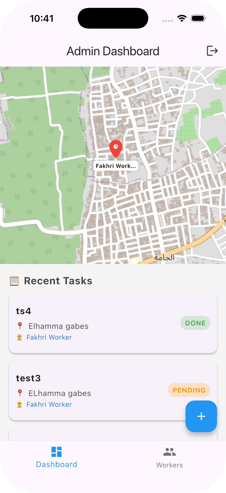

# 🌊 FieldFlow: The Future of Field Operations Management

## ⚡ The Challenge: Small & Medium Enterprises (SMEs)
In a world that moves at lightning speed, many small and medium enterprises are still trapped in the "Analog Age." Disorganized tasks, lost client information, and a complete lack of visibility on field worker locations. This chaos leads to wasted time, frustrated customers, and lost revenue.

## 🛡️ The Solution: Our Mission
**FieldFlow** was born to bridge this gap. We didn't just build an app; we engineered a **Field Intelligence System**. By integrating real-time GPS tracking, cloud-based task management, and instant communication, we empower business owners to take full control of their operations from a single dashboard. 

---

## 📱 Project Preview
| Admin Dashboard | Worker Tasks | Live GPS Tracking |
|:---:|:---:|:---:|
|  |  |  |

---

## 🔥 Key Architectural Features

* **🎯 Strategic Oversight (Admin):** An interactive battlefield map showing every worker's live location. Assigning tasks is now as simple as a single tap.
* **🛠️ Ground Intelligence (Worker):** A focused workspace where workers receive clear missions, navigate via integrated Google Maps, and provide instant visual proof of completion.
* **📡 Real-Time Synchronicity:** Powered by **Firebase**, ensuring that every movement and status update is reflected across the entire system instantly.
* **📸 Visual Verification:** Workers can upload photos directly to the cloud, giving admins a transparent view of the work quality.

---

## 🛠️ Technical Stack
* **Framework:** Flutter (Android, iOS, Web)
* **Backend:** Firebase (Auth, Firestore, Storage)
* **Location Services:** Geolocator & Google Maps API

---

## 🤝 Connect with the Developer
Are you looking to revolutionize your business operations or discuss technical collaborations? Let's build the future together.

* **📧 Email:** [fakhr.farhat@gmail.com](mailto:fakhr.farhat@gmail.com)
* **💬 WhatsApp:** [+216 94 380 416](https://wa.me/+21694380416)
* **📸 Instagram:** [@fd_farhat](https://www.instagram.com/fd_farhat?igsh=MXdvaW51dzZ0OWpoMQ==)

---

## ⚙️ Setup Instructions
1.  **Clone:** `https://github.com/Xoner1/fieldflow.git`
2.  **Dependencies:** `flutter pub get`
3.  **Firebase:** You must add your own `google-services.json` and `GoogleService-Info.plist` to enable the backend features.
4.  **Run:** `flutter run`

---
*Created with passion to empower businesses everywhere.*
